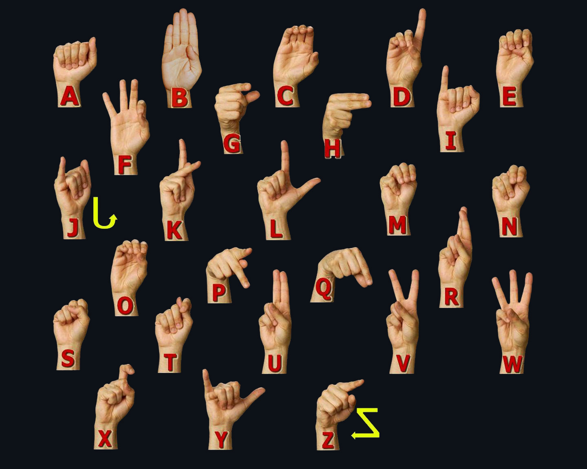
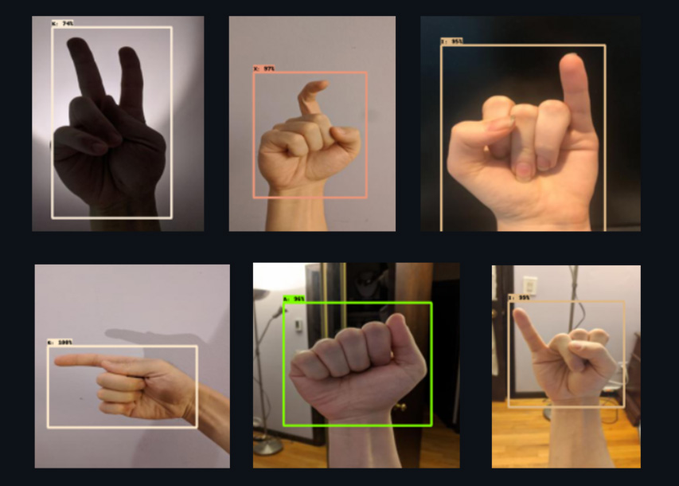

# Object Detection Model for Sign Language Identification

This repository contains code for training a custom object detection model that can identify all 26 engilsh alphabets using TF2 object detection API. 

The model is based on ResNet101 Faster R-CNN algorithm. The repository includes one Jupyter notebook containing code for training and inferencing. A few important python files are also provided.

Please note that the dataset is not included in the repository. However, it can be downloaded from [Roboflow](https://public.roboflow.com/object-detection/american-sign-language-letters/1) websiite. The downloaded zip file will have three folders, for test, train and validation set. You can use all three. In this case, I have combined the test and validation set to make a bigger test set. when dowloading, select the appropriate format for anotations. in this case, the annotations are in the COCO format and include bounding boxes around the birds in form of XML files. You can download TF-records from the website too.

## Setup

In order to utilize the jupyter notebook and code files in this repository, it is necessary to have TensorFlow object detection API installed. To install it, please refer to the official documentation provided in the following link:

[Official Documentation for TensorFlow Object Detection API Installation](https://tensorflow-object-detection-api-tutorial.readthedocs.io/en/latest/install.html)

You will also need to clone the models repository from tensorflow github.

Once the installation process is complete, you can proceed with using this repository to execute the code.

## Installation

To install and use the code in this repository, clone this repository: 

    git clone https://github.com/AbdullahTabassam/Sign_language_Object_Detection.git
    
## Jupyter notebook

- **Create label maps**: The first step is to create the label maps. a script is written that will generate all the alphabets and ids and create the labelmap automatically.

- **TF-Records**: The `generate_tfrecord.py` file is used to create `test.record` and `train.record` files. An important change t be made in `generate_tfrecord.py`, if using the original file, is to change the `bndbox` position in `object` tag from 4 to 5 as the available XML files have the `bndbox` object at 5th position instead of 4th.

- **Hyper-params and Training**: Set the hyperparameters in the `pipeline.config` file and run the script for training. You can play around with various options steps, batch size, learning rate, etc.

- **Inference**: The last step is to perform inferncing on the unseen images. A few of detections are shown below.

## Detections
A few of the detections are shown below:

### Note: Because of the large file size, training checkpoints are not added to the repo. If you need to inference the model, you can use the frozen model checkoints in [saved_model](Sign_Language_detection/training/TF2/training/faster_rcnn_resnet101_v1_1024x1024_coco17_tpu-8/saved_model/saved_model) folder.